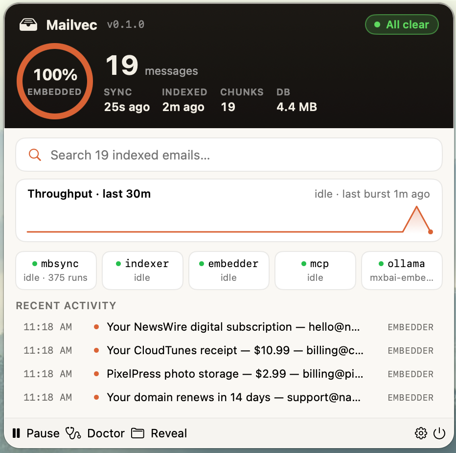
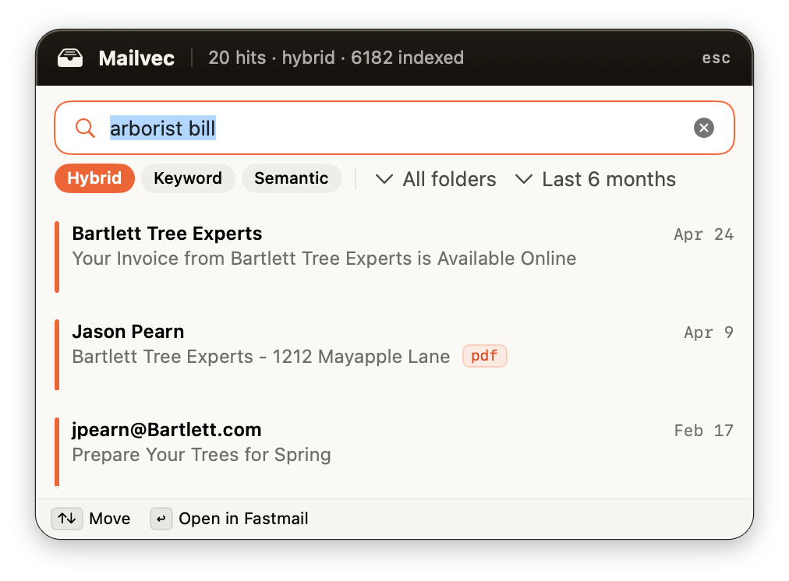
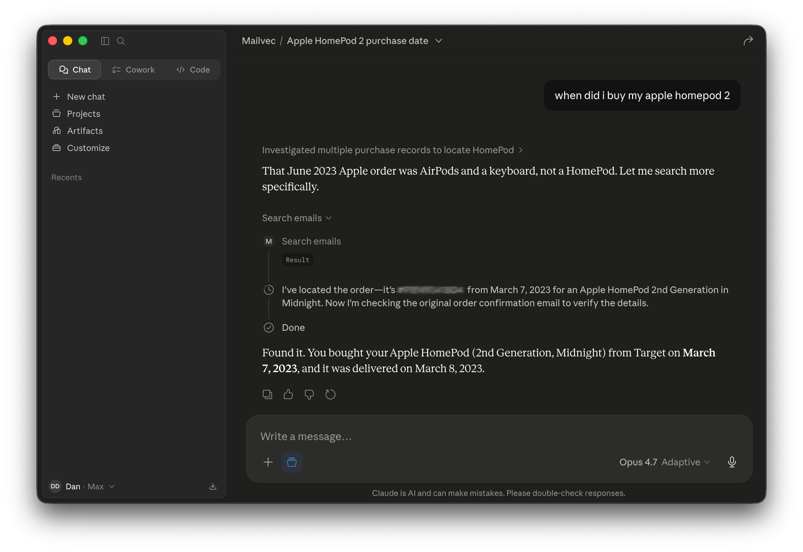

# Mailvec

Local-first IMAP archive with keyword (FTS5) and semantic (sqlite-vec) search, exposed to Claude over MCP. Single-account, single-machine, designed to run unattended on a Mac mini.

Sync is done by [`mbsync`](https://isync.sourceforge.io/), so any IMAP server works — Fastmail, iCloud, Gmail (with an app password), self-hosted Dovecot, etc. The shipped `ops/mbsyncrc.example` and reference design use Fastmail; swap the `Host` / `User` / `PassCmd` lines and the rest of the pipeline is unchanged.

<table>
  <tr>
    <td align="center"><br/><em>Tray dashboard</em></td>
    <td align="center"><br/><em>Inline search popover</em></td>
    <td align="center"><br/><em>Claude Desktop using Mailvec</em></td>
  </tr>
</table>

## What you get

- **A local searchable archive** of your IMAP account on disk — keyword (FTS5/BM25), semantic (sqlite-vec, mxbai-embed-large), and hybrid (RRF fusion) search.
- **An MCP server** Claude Desktop, Claude Code, and other local agents can call to search your mail, fetch threads, and extract attachments.
- **A menu-bar app** for live status, inline search, and one-click ops tasks. Optional — the whole pipeline works headless.

## Architecture

Four .NET services + a SwiftUI tray app, communicating only through the filesystem (Maildir) and the SQLite database.

```
Fastmail (or any IMAP)
    │ IMAP (Pull-only, read-only)
    ▼
mbsync ──► ~/Mail/<account>/  (Maildir)
                │ FileSystemWatcher
                ▼
        Mailvec.Indexer  ──┐
                           │ writes messages + FTS5
                           ▼
                    archive.sqlite  ◄── reads ── Mailvec.Mcp ──► Claude (over MCP/HTTP)
                           ▲                       │
                           │ writes chunks         │ /tray/* (REST)
                           │ + vectors             ▼
        Mailvec.Embedder  ──► Ollama         Mailvec.Tray (SwiftUI menu-bar app)
                              (localhost:11434)
```

## Quickstart

Requires macOS 14+, the .NET 10 SDK, and a few brews. Embeddings are local-only via Ollama.

```sh
# 1. Prereqs
brew install dotnet isync xcodegen
brew install --cask ollama-app   # the cask, NOT `brew install ollama` — see note below
open -a Ollama                   # launch once; enable "Open at Login" to survive reboot
ollama pull mxbai-embed-large

# 2. Configure mbsync (see docs/imap-setup.md for the Fastmail / Keychain dance)
cp ops/mbsyncrc.example ~/.mbsyncrc && chmod 600 ~/.mbsyncrc
$EDITOR ~/.mbsyncrc                              # set User + PassCmd
mbsync -aV                                       # first sync — may take hours for a big archive

# 3. Build + install everything
./ops/fetch-sqlite-vec.sh                        # one-time: pulls vec0.dylib
./ops/install-all.sh                             # services + tray app, launchd-managed
```

> **Install Ollama via the cask (`ollama-app`), not the `ollama` formula.** The Homebrew *formula* bottle has shipped incomplete builds that bundle only the MLX runner and no `llama-server`, so GGML models like `mxbai-embed-large` fail to load (`llama-server binary not found`) — Ollama answers HTTP but every `/api/embed` hangs. The cask is Ollama's own complete prebuilt app, auto-updates, keeps the `ollama` CLI on your PATH, and is what the tray's "Start Ollama" button launches. If you previously installed the formula: `brew services stop ollama && brew uninstall ollama`, then install the cask.

`install-all.sh` orchestrates three scripts and prompts for site-specific values (Maildir root, DB path, Ollama URL, optional Fastmail account id). Use `--no-tray` to skip the SwiftUI build.

Then connect Claude Desktop:

```sh
./ops/build-mcpb.sh                              # writes dist/mailvec-<version>.mcpb
open dist/mailvec-*.mcpb                         # one-click install into Claude Desktop
```

## Validating the install

```sh
mailvec doctor          # one-stop preflight: DB, schema, vec0, Maildir, Ollama, launchd, /health
mailvec status          # message count, embedding coverage, schema/model match
curl -s http://127.0.0.1:3333/health | jq .
```

`doctor` rolls all of the above into one checklist, returning exit 1 if any check fails. `--no-net` skips Ollama and HTTP probes for offline diagnosis; `--json` produces a machine-readable dump for bug reports.

## Documentation

Operations and dev:

- **[docs/imap-setup.md](docs/imap-setup.md)** — mbsync config, Keychain, first-sync, Fastmail label-filtering gotcha
- **[docs/dev-walkthrough.md](docs/dev-walkthrough.md)** — point the pipeline at a throwaway DB for debugging without touching production
- **[docs/logs.md](docs/logs.md)** — log paths, rotation, dev overrides

Client wiring:

- **[docs/clients/](docs/clients/)** — per-client snippets (Claude Desktop, Claude Code, Gemini CLI, Codex CLI, ChatGPT desktop)
- **[docs/tray.md](docs/tray.md)** — menu-bar app
- **[docs/attachments.md](docs/attachments.md)** — how `get_attachment` works + filesystem-MCP wiring
- **[docs/fastmail-deep-links.md](docs/fastmail-deep-links.md)** — optional `webmailUrl` field
- **[docs/security.md](docs/security.md)** — threat model: what's exposed, what's accepted, what's out of scope
- **[docs/future-ideas.md](docs/future-ideas.md)** — deferred work (cloud-LLM access, tailnet, OCR)

Project:

- **[CHANGELOG.md](CHANGELOG.md)** — phase-by-phase build history
- **[CLAUDE.md](CLAUDE.md)** — contributor-facing architectural map, build conventions, gotchas
- **[ops/UPGRADING.md](ops/UPGRADING.md)** — bumping NuGet packages, the .NET SDK, sqlite-vec, SQLite, Ollama floor
- **[ops/mcpb-release.md](ops/mcpb-release.md)** — building and shipping the MCPB bundle

## Security model

Single-user, single-Mac. The macOS user account is the trust boundary; inside it any local process can call any tool, outside it Mailvec is unreachable. The MCP HTTP server binds `127.0.0.1`, all five tools are read-only against the database, and `get_attachment`'s only filesystem write is a sanitized + path-contained drop into `~/Downloads/mailvec/`. There's no authentication, no rate limiting, and `Mcp:LogToolCalls=false` by default — turning it on writes query strings into the rolling log files. Full discussion (what's accepted, what's out of scope, why Phase 5 doesn't change the model) lives in [`docs/security.md`](docs/security.md). Read it before changing the bind address, adding a mutating tool, or pointing the server at anything other than loopback.

## Status

End-to-end working with Claude Desktop (MCPB stdio) and Claude Code (HTTP); Phase 5 (other local agents — Gemini CLI, Codex CLI, ChatGPT desktop) not yet started. See [CHANGELOG.md](CHANGELOG.md) for the phase-by-phase history.
