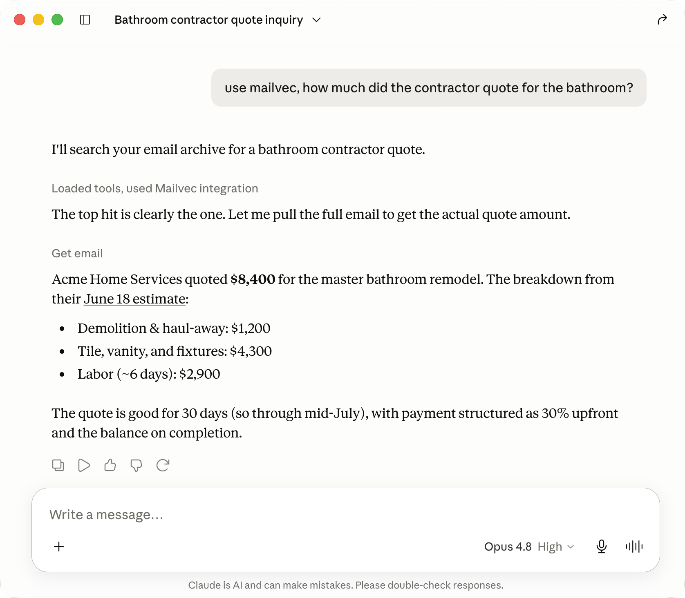

# Mailvec

Mailvec pulls one IMAP account into a searchable local archive and gives MCP clients access to it. Search combines keyword (FTS5) and semantic (sqlite-vec) results. [`mbsync`](https://isync.sourceforge.io/) handles the pull-only mail sync, so Fastmail, iCloud, Gmail, and other IMAP servers can be used.

   
  <em>Claude Desktop using Mailvec</em>

Screenshot uses a synthetic demo archive — no real mail.

## What you get

- A local Maildir and SQLite archive with keyword, semantic, and hybrid search.
- An MCP server for searching mail, reading threads, and viewing attachment text or images in Claude and other MCP clients. See [attachment capabilities](docs/attachments.md).
- A `mailvec` CLI for status, diagnostics, maintenance, and retrieval evals.

The pipeline is `IMAP → mbsync → Maildir → indexer → SQLite`; the embedder adds vectors, and the MCP server reads the archive. The Docker deployment also isolates mail parsing in a separate service. See the [documentation index](docs/README.md) for architecture and operator guides.

## Get started

Choose the machine that will hold the Maildir and database:

| Deployment | Start here | Client connection |
| --- | --- | --- |
| **One Apple Silicon Mac** | [macOS getting started](docs/getting-started-macos.md) — launchd services and local Ollama | [Local client setup](docs/clients/README.md) |
| **Always-on Linux Docker host** | [Docker getting started](docs/getting-started-docker.md) — compose stack and an external Ollama host | [Remote access through Cloudflare](docs/remote-access-cloudflare.md), if you want clients outside the stack |

Both paths start with an IMAP account and provider-appropriate credentials (Fastmail, Gmail, and iCloud use app-specific passwords). The macOS path is the simplest single-machine install. The author's deployment runs in Docker; the Mac is now a frozen-corpus development machine. **Do not run install scripts on that development machine**; see [local development](docs/contributing/local-dev-dataset.md).

After installation, run `mailvec doctor` and `mailvec status` (or `docker compose exec mcp mailvec doctor` and `status` in Docker). Keyword search works while the initial embedding pass is still running; a large archive can take hours or days to finish embedding.

## Privacy and scope

Mailvec is for one account and one owner. Ollama is the default for embeddings and OCR. Hosted embedding or OCR providers send mail content to the configured service and require an explicit opt-in. A local MCP server binds to loopback; the Docker deployment publishes no host port by default. Read the [security model](docs/security.md) before exposing the server or enabling hosted providers.

For installation details, backups, operations, development, and design history, use the [documentation index](docs/README.md). The [changelog](CHANGELOG.md) records project history, and [CLAUDE.md](CLAUDE.md) is the contributor guide for code changes.
