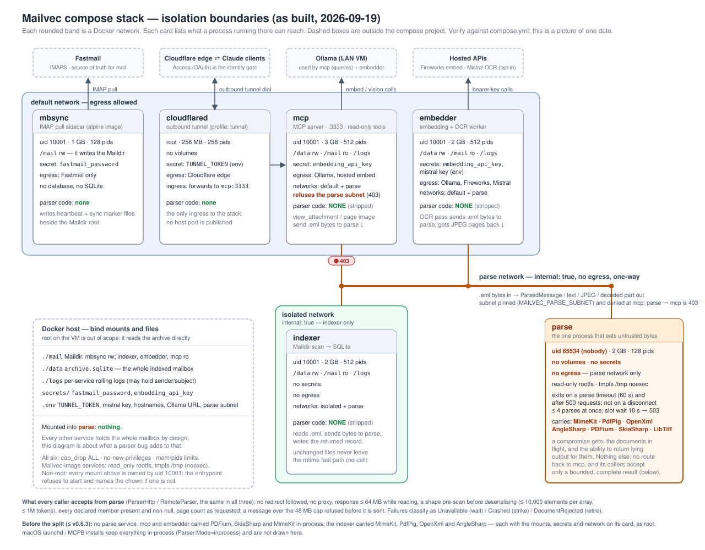

# Security model

Mailvec is a single-account mail archive. Every client allowed to use its MCP tools can read the whole archive. Choose one deployment boundary: a local macOS install bound to loopback, or a Docker stack with no published MCP host port and, for remote clients, a tunnel protected by Cloudflare Access. See [macOS setup](getting-started-macos.md), [Docker setup](getting-started-docker.md), and [remote access](remote-access-cloudflare.md).

## What's exposed

| Surface | Data and boundary |
| --- | --- |
| MCP tools | Search, message and attachment reads. The tools do not mutate the archive or write attachment files. The CLI's explicit `extract-attachments` command does write files. |
| `/up` | Minimal external status and liveness flags. It omits archive paths, counts, model identity, and internal URLs. Use it for monitoring. |
| `/health` | Detailed state, including paths and model information. Loopback-only by default (`Mcp:RestrictHealthToLoopback`). |
| Docker volumes | `./data` holds SQLite; `./mail` holds source mail. The parser has neither mount. |
| Provider traffic | Ollama receives embeddings and, with local OCR, rendered pages. Optional hosted providers receive the data described below. |

The Docker MCP service listens inside Compose but has **no published host port**. Cloudflare Tunnel is the configured external ingress; Access authorizes users at the edge. Without `Mcp:Access`, any process that can reach the MCP origin on its Compose network can call the tools. HostGuard checks `Host` and `Origin` headers against loopback and `Mcp:AllowedHosts` to prevent browser-mediated DNS rebinding; it is not authentication. If a host port is published, LAN callers can bypass Access unless origin validation is enabled.

### Docker Compose network boundaries

`compose.yml` defines the actual topology. `indexer` and `parse` use internal networks without external egress. The parser receives mail bytes over the `parse` network but has no archive, Maildir, or secret. Docker networks are bidirectional, so MCP denies inbound requests from the pinned parse subnet through `Mcp:DeniedNetworks`. Check `docker compose config` and the [deployment probe](deploy-docker.md#rollout-checklist) whenever changing network membership or `MAILVEC_PARSE_SUBNET`.

### `/up` and `/health`

External monitors should use `/up`, protected by a service token scoped to that exact path. The root Access application must not use **Any Access Service Token**, which would admit monitoring credentials to the mail tools. Verify with the monitoring token: `/up` returns JSON, while a `tools/list` request to `/` is denied. The Access policy lives outside this repository; [the remote-access guide](remote-access-cloudflare.md#scope-a-monitoring-credential) gives the setup and probe.

`/health` is for the container's loopback healthcheck and `mailvec doctor`. Inspect it with `docker compose exec mcp curl -fsS http://127.0.0.1:3333/health`. A tunnel ingress rule can also return 404 for `/health`, but the origin's loopback restriction is the local control.

## Container hardening

Mail content and attachments are untrusted input. In Docker, MIME, HTML, Office, PDF, and image parsers run in the `parse` service. The build strips parser libraries from indexer, embedder, MCP, and CLI outputs. `parse` has no mounted data or secrets, no external route, and runs as an unprivileged user. It can restart after a timeout or request limit. A compromised parser can see in-flight documents and return false parsed content; it should not be able to read the archive or call MCP back.

Compose also uses non-root service users, dropped capabilities, `no-new-privileges`, read-only root filesystems for .NET services, temporary writable storage, and memory and PID limits. The mounted archive, Maildir, logs, and credentials must be owned by the configured service uid. Limits and network placement are in `compose.yml`, which is the source of truth. Check the [Docker runbook](deploy-docker.md#permissions-and-parser-service) when changing ownership or limits.

The MCP parser return-path denial depends on the configured subnet matching the actual `parse` network. Probe MCP from that network and expect 403. The parser client also rejects redirects and oversized responses. Search can continue during a parser outage, while ingest, OCR, and attachment rendering wait or fail temporarily.

## Executable supply chain

The sqlite-vec download is checked against a version-and-platform SHA-256 in `ops/fetch-sqlite-vec.sh` before extraction. Docker base images, cloudflared, BuildKit, and GitHub Actions are pinned; update them through their documented dependency workflows. CI checks NuGet packages for known vulnerabilities, including transitive packages. See [dependency upgrades](../ops/UPGRADING.md) and the checked-in build files for current pins.

## Hosted OCR (`Vision:Provider=mistral`)

Local Ollama OCR is the default. With hosted OCR enabled, the embedder sends each eligible rendered PDF page or image to the configured endpoint automatically, without a user tool call. Such documents can contain sensitive data. Review the provider's retention, training, and residency terms before enabling it. The OCR credential belongs to the embedder only; use the supported file-secret or environment channel, never a checked-in config file. Disabling hosted OCR stops future sends but cannot retract submitted pages or remove previously stored OCR text.

## Hosted embedding (`Embedding:ActiveProfile`)

A hosted embedding profile sends indexed body and attachment text chunks to the provider, plus semantic and hybrid search queries. Switching an existing archive re-embeds the historical corpus. Review the provider's data terms and cost controls before activation. Keep the API key in the owner-only `secrets/embedding_api_key` file; only MCP and embedder need it. Identity checks refuse a mixed vector space. The hosted client connects directly and ignores `HTTP(S)_PROXY`; a profile may opt into the environment's proxy (`Proxy=environment`) only if it holds no key (`Auth:Scheme=none`), which exists for the synthetic [dev corpus](contributing/dev-corpus.md) in Claude cloud sessions, where the egress proxy attaches the key. To return to Ollama, clear the profile and run `mailvec switch-model` as described in the [Docker runbook](deploy-docker.md#hosted-embedding-provider).

## The other shape: a loopback-only local install

The macOS install binds HTTP to `127.0.0.1:3333` and can serve stdio clients. A process under another account on the same machine can still reach loopback, so protect the Maildir and archive with OS permissions. Parsers run in-process on macOS; the separate Docker parser boundary does not apply. Do not expose the loopback service through a port forward without adding authentication.

## Tools and data flow

The seven MCP tools (`search_emails`, `get_email`, `get_thread`, `list_folders`, `view_attachment`, `get_attachment_text`, `get_attachment_page_image`) read the archive. Attachment viewing decodes source files in memory. `get_attachment_text` reads extracted text from SQLite. The explicit CLI `extract-attachments` path writes files under its configured download directory and checks path containment and symlinks. See [attachment behavior](attachments.md).

## Host / origin validation (DNS-rebinding guard)

HostGuard returns 403 unless the request's `Host` and any `Origin` match loopback or `Mcp:AllowedHosts`. Set `MCP_PUBLIC_HOSTNAME` for a tunnel deployment so the forwarded public Host is allowed. A caller that can reach the origin directly can spoof these headers; use Access and, where appropriate, origin authentication for identity.

## Origin authentication (`Mcp:Access`)

When enabled, MCP validates Cloudflare's `Cf-Access-Jwt-Assertion` at the origin. Configure the Access team domain, root application audience, optional monitoring audience, and an allowlist of owner emails or permitted service-token IDs. The monitoring token must be excluded from the owner allowlist. A valid root audience alone cannot compensate for an overly broad Access policy: Cloudflare issues the audience of the application that matched the request. `Mcp:Access` is off by default; enable and verify it with the [remote-access procedure](remote-access-cloudflare.md#origin-validation-of-the-access-assertion-mcpaccess). Keep the loopback exemption for in-container healthchecks.

## Hostile mail content (indirect prompt injection)

Mail bodies, attachments, sender fields, headers, and filenames are attacker-controlled. MCP responses frame that content as untrusted, and labels in server-written text are sanitized. Those measures do not prove an AI client will ignore instructions inside a message. Treat any agent allowed to call Mailvec as able to read the whole archive and evaluate its other connected tools accordingly. See [future work](future-ideas.md#adversarial-testing-of-the-prompt-injection-framing) for model-level testing.

## Response bounds

MCP limits concurrent requests and queue length. Search limits results; attachment text is paged; thread and message bodies have explicit size caps with truncation reported in the response. These controls bound memory and response size, not the amount of mail an authorized client can read over multiple calls.

## What's accepted

- Authorized clients can call every read tool, including on-demand attachment rendering. There is no per-tool or per-identity scope. Do not admit a client that should see less than the entire mailbox.
- With `Mcp:Access` disabled, the Compose origin trusts reachable network peers. Keep its host port unpublished and the tunnel as the only external ingress. Enable origin validation for an additional identity check.
- Parser isolation limits direct access to stored mail and credentials, but a compromised parser can falsify results for documents it handles. Keep its mounts, egress, network denial, and response bounds intact.
- `Mcp:LogToolCalls` is off by default. When enabled, queries and result summaries can include addresses, subjects, and filenames. Ordinary logs can also contain paths and message identifiers; protect both rolling files and Docker logs. See [Logs](logs.md).
- There is no per-identity request-rate limit. MCP concurrency limits bound simultaneous work, while Access limits who can request it.

## What's out of scope

Mailvec does not provide multi-tenant mail separation, application-level encryption at rest, or a defense against a malicious or compromised client that is already authorized to read mail. Host administrators with root or Docker control can read the mounted files directly. Adding another identity or a mutating tool requires revisiting the authorization model.
